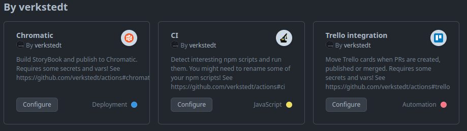

# Technical Design

## Goals

- Something that covers 99% needs of 80% of our projects instead of
  something that covers 80% of 99% of our projects

- Opinionated GH actions setup for our projects that work out of the box

  For most projects it should require only copying template workflows
  and setting up few secrets and vars. These will be kept to minimum by
  setting them in the organisation level, where it makes sense.

- Easy to maintain

  Try hard to keep things backwards compatible, so we can keep
  everything pointed `@v1` forever and only change things in this
  repository, without having to create 1000s of PRs updating these in
  other projects. 🧘

## Assumptions

- Only for JavaScript projects.
- Main branch is called `main`.
- “CI” workflow template should be enough for _most_ of the projects.

## Organisation

### Composite actions

Each action lives in a separate directory (e.g. `./setup/` and should
include `action.yml` defining the action as well as `README.md`.

Read more about [composite actions](https://docs.github.com/en/actions/creating-actions/creating-a-composite-action)

### Reusable Workflows

They live in `./.github/workflows/`, as is required by GitHub. Each
workflow should come with accompanying workflow template.

Reusable workflows SHOULD NOT use `secrets` (apart from GitHub provided
ones like `GITHUB_TOKEN`) and `vars`. Only define `inputs`. Inputs
SHOULD have default values, when possible.

Read more about [reusable workflows](https://docs.github.com/en/actions/using-workflows/reusing-workflows)

### Workflow Templates

They live in
[`verkstedt/.github/workflow-templates/`](https://github.com/verkstedt/.github/tree/main/workflow-templates)
(Note: _not_ this repository). This way if you go in your repository to
“Actions” → “New workflow” you will see them under “By verkstedt”.

Workflow templates can use `secrets` and `vars`. This allows us to set
these at organisation level with sane values and only override them in
repositories when necessary.

Workflow templates SHOULD be kept as short as possible — ideally only
setting up triggers (e.g. “on push to main branch”), calling a reusable
workflow and for workflows that run on the main branch, sending
notification on failure.

Read more about [workflow templates](https://docs.github.com/en/actions/using-workflows/creating-starter-workflows-for-your-organization)

> [!NOTE]
> Why use templates at all? This allows us to change the workflows and
> see it being reflected in all repositories without having to update
> all of them. As long as we keep changes backwards–compatible, we don’t
> ever have to migrate any existing repositories, when we change
> workflows.

## Breaking changes

If we ever need to introduce any breaking changes to existing actions or
workflows, we’ll need to create new branch (e.g. `v2`) and make that the
new main branch. Then go through existing repositories and update
references to target new version.

Because of how much work this is, we MUST avoid introducing breaking
changes as much as possible.
