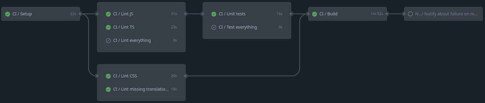
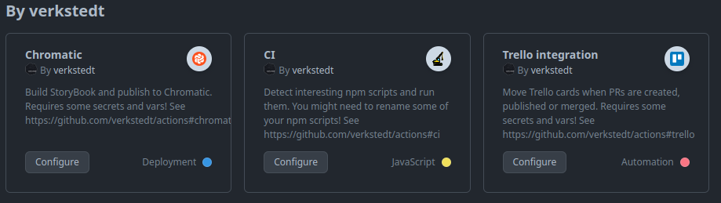

# verkstedt GitHub actions

- [projects using this](https://github.com/search?type=code&q=-repo:verkstedt/actions+path:.github/workflows/+uses:+verkstedt/actions)



## Goals

- Something that covers 99% needs of 80% of our projects instead of
  something that covers 80% of 99% of our projects

- Opinionated GH actions setup for our projects that work out of the box

  For most projects it should require only copying template workflows
  and setting up few secrets and vars. These will be kept to minimum by
  setting them in the organisation level, where it makes sense.

- Easy to maintain

  Try hard to keep things backwards compatible, so we can keep
  everything pointed `@v1` forever and only change things in this
  repository, without having to create 1000s of PRs updating these in
  other projects. 🧘

## Assumptions

- Only for JavaScript projects.
- Main branch is called `main`.
- “CI” workflow template should be enough for _most_ of the projects.

## Quick start

1. Copy `workflow-templates/*.yaml` files from
   [verkstedt/.github][workflow-templates] (_not_ this repository) to
   `.github/workflows/` in your repository.

   - skip `chromatic`, if your project doesn’t use it
   - skip `trello`, if your project doesn’t use it 😿

2. When workflows run, they will most probably fail, because some
   secrets and/or vars are missing, but error messages should guide you
   where to take them from.

3. You might have these defined on the GitHub organisation level, but
   want to overwrite them with project–specific values:

   - `SLACK_CHANNEL_ID` var, if you have a project–specific channel
   - `TRELLO_ORG_NAME` var, if your project is not in default workspace

4. If “CI” workflow didn’t detect something you’d want it to run,
   customise it (see comments in the file).

5. Set your `main` branch as protected and require passing the checks. 🔓

## Parts

- Workflow templates
  ([docs](https://docs.github.com/en/actions/using-workflows/creating-starter-workflows-for-your-organization))

  _This is probably the thing you are interested in._

  They don’t live in this repository, but in
  [verkstedt/.github][workflow-templates]. This way if you go in your
  repository to “Actions” → “New workflow” you will see them under “By
  verkstedt”.

  If they don’t show up there, copy them to your repository from
  [verkstedt/.github][workflow-templates].

  

- Reusable workflows
  ([docs](https://docs.github.com/en/actions/using-workflows/reusing-workflows))

  Because we copy templates to repositories, we use “reusable workflows”
  to centralise things as much as possible, so in most cases we can
  add/fix things here instead of having to update every single repo.

- Composite actions
  ([docs](https://docs.github.com/en/actions/creating-actions/creating-a-composite-action))

  Repeating steps extracted from reusable workflows and/or workflow
  templates.

## Workflow templates

### CI

Template:
<https://github.com/verkstedt/.github/tree/main/workflow-templates/ci.yaml>

First runs setup action to warm up the cache and then runs detected npm
scripts as paralel jobs:

- `lint:js`
- `lint:ts`
- `lint:css`
- `lint:missing-translations`
- `lint` (if no `lint:*` scripts present)
- `test:unit`
- `test` (if no `test:*` scripts present)
- `build`

#### What’s the deal with `:` in script names?

In many projects you might end up having more than one linter or tester
to run (e.g. `eslint`+`stylelint` or `jest`+`playwright`). To keep
things handy in the command like, we aim to have `npm run lint` run all
of the linters, but in the CI we want to run them separately to be able
to see what’s failing more clearly.

What you’ll want to do is install `npm-run-all` in your project and
have something like:

```json
"scripts": {
  "lint": "npm-run-all 'lint:*'",
  "lint:js": "eslint .",
  "lint:css": "stylelint '**/*.css'"
}
```

### Chromatic

Template:
<https://github.com/verkstedt/.github/tree/main/workflow-templates/chromatic.yaml>

Builds [StoryBook] and publishes to [Chromatic].

Runs only on `main` branch and published PRs.

Requires some vars and/or secrets.
See [./.github/workflows/chromatic.yaml][workflow-chromatic] for details.

### Trello

Template:
<https://github.com/verkstedt/.github/tree/main/workflow-templates/trello.yaml>

Moves [Trello] cards when PRs are created, published or merged.

Requires some vars and/or secrets.
See [./.github/workflows/trello.yaml][workflow-trello] for details.

## Deploying new versions of actions and workflows

You might have noticed that main branch in this repository is called
`v1` not `main`. This means that when something is merged, it will be
picked up by all projects using us `@v1`. We don’t create any release
git tags.

In case we’d have to introduce any breaking changes we will create a
`v2` branch (and set it as default), but we should try hard to avoid
that.

## FAQ

### How do I pass secrets?

Pass `build_env` secret to CI workflow, like so:

```jobs:
  ci:
    name: 'CI'
    uses: verkstedt/actions/.github/workflows/ci.yaml@v1
    with:
      working-directory: .
    secrets:
      build_env: |
        CF_SPACE_ID=${{ secrets.CF_SPACE_ID }}yaml
```

If it turns out we need that to run e.g. tests, we shall add `test_env`
or similar.

### How do I start something that’s required for running tests?

You have two options:

1. Modify your `npm test` script to do the setup for you.

   Example:

   Let’s assume that your `test` script runs `jest` and you need to run
   `npx mock-server` before.

   - Create separate script file, e.g. `./scripts/test.sh`:

     ```sh
     #!/bin/sh
     set -ue

     if [ -n "${CI-}" ]
     then
       npx mock-server &
       mock_server_pid=$!
       trap "kill \"$mock_server_pid\" 2>/dev/null" EXIT SIGINT SIGTERM SIGHUP
     fi

     jest "$@"
     ```

   - Update script in `package.json`: `"test": "./scripts/test.sh"`

2. Don’t use these workflows.

   See first item on the list of [Goals](#goals).

[storybook]: https://storybook.js.org/docs/get-started/install
[chromatic]: https://www.chromatic.com/start
[trello]: https://trello.com
[workflow-chromatic]: ./.github/workflows/chromatic.yaml
[workflow-trello]: ./.github/workflows/trello.yaml
[workflow-templates]: https://github.com/verkstedt/.github/tree/main/workflow-templates
