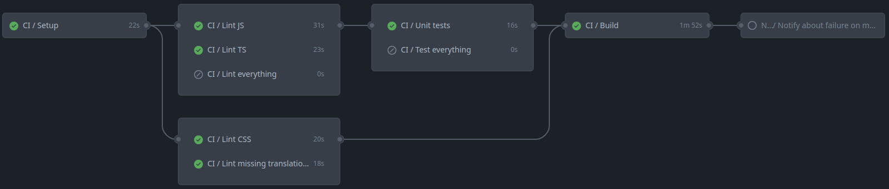

# verkstedt GitHub actions

- [projects using this](https://github.com/search?type=code&q=-repo:verkstedt/actions+path:.github/workflows/+uses:+verkstedt/actions)



## Technical design

Read [`DESIGN.md`](./DESIGN.md) for more information about goals of this
project and how things are organised and why.

## Quick start

1. Copy `workflow-templates/*.yaml` files from
   [verkstedt/.github][workflow-templates] (_not_ this repository) to
   `.github/workflows/` in your repository.

   - skip `chromatic`, if your project doesn’t use it
   - skip `jira`, if your project doesn’t use it

2. If your project doesn’t have `package.json` in the root, change
   `working-directory` from `.` in all of the files that define it.

   If you have multiple `package.json` files, create separate YAML files
   for each of them. Also change `name:` to be able to distinguish
   between them.

3. You might have these defined on the GitHub organisation level, but
   want to overwrite them with project–specific values:

   - `SLACK_CHANNEL_ID` var, if you have a project–specific channel

     - In Slack, open the channel.
     - Open the channel details (the channel name on the top of the screen)
     - The channel ID is at the bottom

   - `JIRA_STATUS_*` vars, if your project uses custom status names. You
     can also set var to empty string to disable that transition.

4. Create a test PR to check if workflows run as expected.

   Some of the checks are skipped for draft PRs, so make sure to
   publish.

   1. When workflows run, they will most probably fail, because some
      secrets and/or vars are missing, but error messages should guide
      you where to take them from.

   2. If “CI” workflow didn’t detect something you’d want it to run,
      customise it (see comments in the file).

   3. Set your `main` branch as protected and require passing the checks. 🔓

      Make all of the “CI / CI / (…)” checks that were not skipped in
      your test PR required. If you use Chromatic, you’ll also want to
      make “UI Tests” required.

## Workflows

### CI

Template:
<https://github.com/verkstedt/.github/tree/main/workflow-templates/ci.yaml>

First runs setup action to warm up the cache and then runs detected npm
scripts as paralel jobs:

- `lint:js`
- `lint:ts`
- `lint:css`
- `lint:missing-translations`
- `lint` (if no `lint:*` scripts present)
- `test:unit`
- `test` (if no `test:*` scripts present)
- `build`

#### What’s the deal with `:` in script names?

In many projects you might end up having more than one linter or tester
to run (e.g. `eslint`+`stylelint` or `jest`+`playwright`). To keep
things handy in the command like, we aim to have `npm run lint` run all
of the linters, but in the CI we want to run them separately to be able
to see what’s failing more clearly.

What you’ll want to do is install `npm-run-all` in your project and
have something like:

```json
"scripts": {
  "lint": "npm-run-all 'lint:*'",
  "lint:js": "eslint .",
  "lint:css": "stylelint '**/*.css'"
}
```

### Chromatic

Template:
<https://github.com/verkstedt/.github/tree/main/workflow-templates/chromatic.yaml>

Builds [StoryBook] and publishes to [Chromatic].

Runs only on `main` branch and published PRs.

Requires some vars and/or secrets.
See [./.github/workflows/chromatic.yaml][workflow-chromatic] for details.

### Jira

Template:
<https://github.com/verkstedt/.github/tree/main/workflow-templates/jira.yaml>

Moves [Jira] issues when PRs are created, published or merged.

Requires some vars and/or secrets.
See [./.github/workflows/jira.yaml][workflow-jira] for details.

### Ref Comment in Commit

Template:
<https://github.com/verkstedt/.github/tree/main/workflow-templates/ref-comment-in-commit.yaml>

When a GH commit URL is included in commit message, link the commit from said comment.

## Deploying new versions of actions and workflows

You might have noticed that main branch in this repository is called
`v1` not `main`. This means that when something is merged, it will be
picked up by all projects using us `@v1`. We don’t create any release
git tags.

In case we’d have to introduce any breaking changes we will create a
`v2` branch (and set it as default), but we should try hard to avoid
that.

## FAQ

### How do I pass env vars to CI workflow?

If any of your npm scripts requires any env vars, set `env_vars` secret
in the repository. Make sure there’s `secrets: inherit` in your
`ci.yaml`.

### How do I start something that’s required for running tests?

You have two options:

1. Modify your `npm test` script to do the setup for you.

   Example:

   Let’s assume that your `test` script runs `jest` and you need to run
   `npx mock-server` before.

   - Create separate script file, e.g. `./scripts/test.sh`:

     ```sh
     #!/bin/sh
     set -ue

     if [ -n "${CI-}" ]
     then
       npx mock-server &
       mock_server_pid=$!
       trap "kill \"$mock_server_pid\" 2>/dev/null" EXIT SIGINT SIGTERM SIGHUP
     fi

     jest "$@"
     ```

   - Update script in `package.json`: `"test": "./scripts/test.sh"`

2. Don’t use these workflows.

   See [Goals](./DESIGN.md#user-content-goals) for this project.

[storybook]: https://storybook.js.org/docs/get-started/install
[chromatic]: https://www.chromatic.com/start
[jira]: https://www.atlassian.com/software/jira
[workflow-chromatic]: ./.github/workflows/chromatic.yaml
[workflow-jira]: ./.github/workflows/jira.yaml
[workflow-templates]: https://github.com/verkstedt/.github/tree/main/workflow-templates
